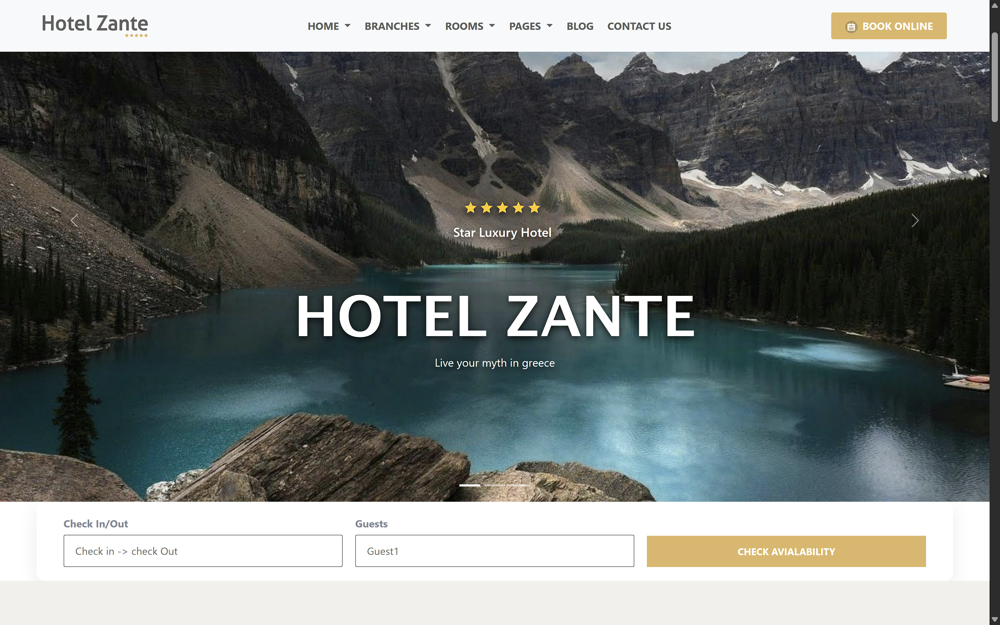

# Hotel Zante Clone — Luxury Resort Booking Landing Page

A luxury hospitality and resort booking website clone inspired by the Hotel Zante theme, built with semantic HTML5, modern CSS3, and Bootstrap 5 featuring full-screen carousels, responsive booking bars, room selection cards, Kashmir destination guides, and guest review highlights.

[](https://syedabsar99.github.io/hotel-zante-clone/)
[](https://getbootstrap.com)
[](style.css)
[](LICENSE)

---

## Preview



> **Live Demo:** [syedabsar99.github.io/hotel-zante-clone](https://syedabsar99.github.io/hotel-zante-clone/)

---

## Overview

Developed by **Syed Noor Ul Absar**, this project replicates the elegant aesthetic and booking flow of high-end hotel resort themes. It demonstrates mastery of responsive layouts, multi-column card grids, luxury color palettes (warm gold and dark charcoal tones), video embedding, and guest feedback sections.

Special care was given to ensuring the floating reservation bar and room inventory display comfortably on both wide desktop displays and mobile phone viewports.

---

## Key Features

- **Full-Width Hero Slider** — Animated Bootstrap carousel with caption overlays, star ratings, and call-to-action buttons.
- **Reservation & Booking Bar** — Elevated check-in/check-out and guest selection form with availability checking triggers.
- **Featured Rooms Grid** — Showcase of rooms (Double Room, Honeymoon Room, King Room, Family Room) with live pricing tags and hover zoom effects.
- **Dining & Amenities Showcase** — Split-column layout highlighting hotel restaurant offerings, menus, and signature hospitality features.
- **Discover Kashmir Visual Guide** — Curated tourist destination gallery exploring Gulmarg, Boulevard, Tosamaidan, and Pahalgam.
- **Guest Testimonial Carousel** — Star ratings and verified traveler reviews with authentic guest portraits.
- **Fully Mobile Responsive** — Custom media queries adapting the booking form, navigation menu, and card grids down to 320px screens.

---

## Tech Stack

| Layer | Technologies | Details |
| :--- | :--- | :--- |
| **Structure** | Semantic HTML5 | Clean section hierarchy, video tags, accessible image attributes |
| **Styling** | Modern CSS3 & Bootstrap 5 | Gold accent branding, responsive grid, flexbox, micro-transitions, media queries |
| **Icons & Fonts** | Google Fonts & Remix Icon | Elegant typography with Remix Icon vector graphics |
| **Hosting** | GitHub Pages | High-speed global static deployment |

---

## Project Structure

```text
hotel-zante-clone/
├── assets/
│   └── images/        # Theme logos and hotel imagery
├── media/             # Video assets (.mp4)
├── index.html         # Complete single-page luxury hotel layout
├── LICENSE            # MIT open-source license
├── preview.png        # High-resolution full-page showcase screenshot
├── README.md          # Comprehensive repository documentation
└── style.css          # Design system, hotel branding, and mobile queries
```

---

## Getting Started

No build tools or bundlers are required.

### 1. Clone the repository
```bash
git clone https://github.com/syedabsar99/hotel-zante-clone.git
```

### 2. Open locally
Launch `index.html` in your browser:
```bash
cd hotel-zante-clone
start index.html
```

Or run via any static web server:
```bash
npx serve .
# or
python -m http.server 8080
```

---

## Author & Contact

**Syed Noor Ul Absar**
- **Role**: Frontend Web Developer
- **Education**: Bachelor of Computer Applications (BCA), Chandigarh University (8.35 SGPA)
- **Portfolio**: [syedabsar99.github.io/portfolio](https://syedabsar99.github.io/portfolio/)
- **GitHub**: [@syedabsar99](https://github.com/syedabsar99)
- **LinkedIn**: [linkedin.com/in/syed-noor-ul-absar-7b6408365](https://www.linkedin.com/in/syed-noor-ul-absar-7b6408365/)
- **Email**: syedabsar99@gmail.com

---

## License

This project is licensed under the [MIT License](LICENSE) — feel free to use, modify, and distribute for educational or personal use.
